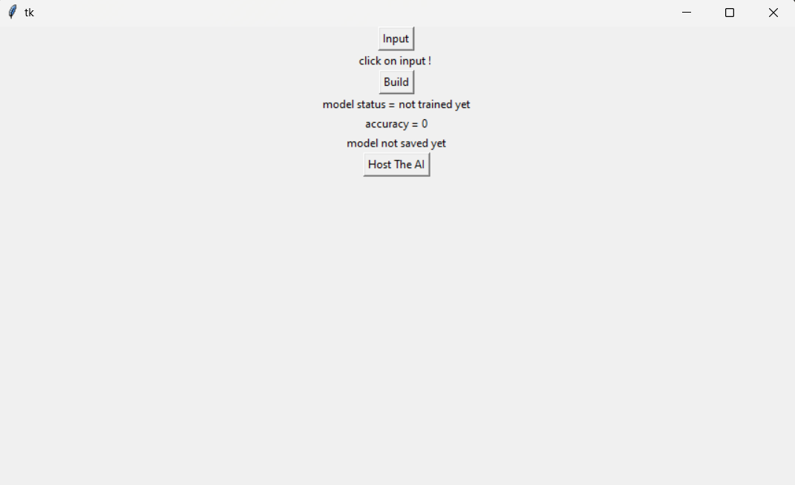

# Automatic-AI-Creator

##  under construction :) 

TO DO:
* save model categories
* tkinter interface (link it to flask)
* flask web interface for the deployment of AI on a local server
* ~~cry in the corner~~

any contributions or suggestions are welcome 
